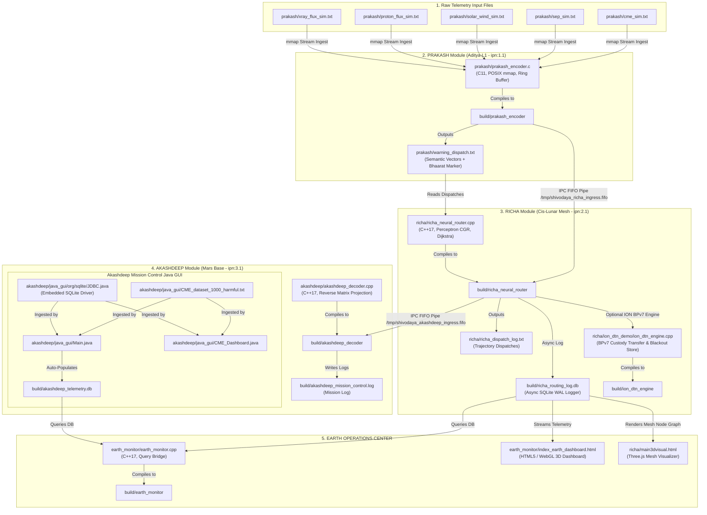

# Project Shivodaya: System Architecture & Execution Flowchart

## Executive Overview
**Project Shivodaya** is a high-performance deep-space mesh network architecture designed for real-time solar radiation telemetry acquisition, space weather alert routing, and delay-tolerant store-and-forward communications.

The system is composed of four primary sub-modules:
1. **Prakash Module (Telemetry Acquisition & Pre-Processing Engine)**: Written in C11, optimized with zero-copy POSIX `mmap()`, lock-free C11 atomic ring buffers, core pinning (`pthread_setaffinity_np()`), L1 cache line isolation (`alignas(64)`), and JSCC 32-float semantic linear projection.
2. **Richa Module (Interplanetary Transport & DTN Engine)**: Written in C++/HTML5/Three.js, implementing dynamic Dijkstra Contact Graph Routing (CGR), Bundle Protocol v7 (RFC 9171 / BPv7) Store-and-Forward Custody Transfer, and a real-time 3D deep space visualizer dashboard.
3. **Akashdeep Module (Autonomous Mission Control & Early Warning System)**: Written in Java Swing (JDK 17+), featuring a pseudo-3D celestial trajectory engine, overall space health meter, automated flight safety advisory engine, dynamic waveform chart builder, and auto-data integration feeder writing to SQLite (`akashdeep_telemetry.db`).
4. **Earth Operations Monitoring Center**: Native C++ SQLite query bridge and HTML5 WebGL dashboard monitoring deep-space agency nodes (ISRO Bhaarat, NASA, ESA, Roscosmos, JAXA).

---

## Complete End-to-End System Flowchart & File Dependencies



---

## File-by-File Dependency & Execution Matrix

### 1. Prakash Module (Telemetry Acquisition & Semantic Encoding)
| File | Language / Type | External & Internal Dependencies | What It Does / How to Run |
| :--- | :--- | :--- | :--- |
| `prakash/prakash_encoder.c` | C11 | `pthread`, `math`, `third_party/sqlite3` | Zero-copy mmap telemetry parser. Compiles to `build/prakash_encoder`. |
| `prakash/*_sim.txt` | Input Data | None | 5 simulation streams (`cme`, `sep`, `solar_wind`, `proton_flux`, `xray_flux`). |
| `prakash/prakash.c` | C11 | `pthread`, `stdatomic.h` | Standalone CLI encoder generating `prakash/warning_dispatch.txt`. Run via `./prakash/run_cmd_demo.sh`. |

### 2. Richa Module (Interplanetary Neural DTN Router)
| File | Language / Type | External & Internal Dependencies | What It Does / How to Run |
| :--- | :--- | :--- | :--- |
| `richa/richa_neural_router.cpp` | C++17 | `pthread`, `sqlite3_static` (`third_party/sqlite3`) | 100-node Perceptron Dijkstra CGR router. Compiles to `build/richa_neural_router`. |
| `richa/richa.cpp` | C++17 | `prakash/warning_dispatch.txt` | Offline batch router script. Run via `./richa/run_richa_demo.sh`. |
| `richa/ion_dtn_demo/ion_dtn_engine.cpp` | C++17 | `pthread`, `math` | Standalone BPv7 store-and-forward custody engine with delayed receiver simulation. Tested via `python3 richa/ion_dtn_demo/test_ion_dtn_engine.py`. |
| `richa/main3dvisual.html` | HTML5 / JS | Three.js (via CDN), `build/richa_routing_log.db` | Interactive 3D Deep Space network mesh visualizer. Open directly in browser. |

### 3. Akashdeep Module (Mars Target Semantic Decoder & Mission Control)
| File | Language / Type | External & Internal Dependencies | What It Does / How to Run |
| :--- | :--- | :--- | :--- |
| `akashdeep/akashdeep_decoder.cpp` | C++17 | `pthread`, `sqlite3_static` | Inverse matrix projection decoder writing to `build/akashdeep_mission_control.log`. |
| `akashdeep/java_gui/Main.java` | Java (JDK 17+) | Java Swing, `org/sqlite/JDBC.java` | Launcher for 3D Celestial Trajectory Engine & Control Center. Run via `./build_java.sh` then `cd akashdeep/java_gui && java -cp "bin" Main`. |
| `akashdeep/java_gui/CME_Dashboard.java` | Java (JDK 17+) | `CME_dataset_1000_harmful.txt`, `org/sqlite/JDBC.java` | Live telemetry dashboard, health meter, safety advisory & chart builder. |

### 4. Earth Operations Monitoring Center
| File | Language / Type | External & Internal Dependencies | What It Does / How to Run |
| :--- | :--- | :--- | :--- |
| `earth_monitor/earth_monitor.cpp` | C++17 | `build/richa_routing_log.db`, `sqlite3_static` | Command line SQLite telemetry log bridge. Compiles to `build/earth_monitor`. |
| `earth_monitor/index_earth_dashboard.html` | HTML5 / JS | Three.js (via CDN), `richa_routing_log.db` | WebGL 3D Earth Station Operations dashboard modal and alert viewer. |

---

## Core Build & Execution Workflows

### 1. Single Command Build
```bash
./build_all.sh      # Compiles all C/C++ modules into build/
./build_java.sh     # Compiles Java Swing GUI into akashdeep/java_gui/bin/
```

### 2. End-to-End Automated Pipeline Execution
```bash
./run_full_mesh_pipeline.sh
```
Executes: `prakash_encoder` $\rightarrow$ `richa_neural_router` $\rightarrow$ `akashdeep_decoder` $\rightarrow$ `earth_monitor`.

---

---

## Detailed Step-by-Step Low-Bandwidth Neural Pipeline Architecture

### Step 1: Prakash Module (Neural Semantic Vector Embedding at Aditya-L1 - ipn:1.1)
- **Problem Solved**: High-volume sensor streams (CME speeds, proton surges, X-ray flux curves) generate continuous numerical data that cannot fit across ultra-low bandwidth deep-space links.
- **Implementation**:
  - `prakash_encoder.c`: Memory-maps 5 telemetry channels (`mmap()`) across CPU cores with lock-free atomic ring buffers (`alignas(64)`).
  - Computes derivative spike detection ($\frac{d\Phi}{dt}$) to catch radiation surges before limit breaches.
  - Applies a 1-layer **JSCC linear projection matrix** to compress raw telemetry into a fixed **32-float semantic vector** (~128 bytes total).
  - Embeds the security signature `'Bhaarat'` into vector header bytes.
- **Concrete Example**:
  ```text
  [RAW SENSOR INPUT]  : TS: 2026-08-28 00:02:00 | CME Speed: 1800.0 km/s | Width: 360 deg | dPhi/dt: 1500.0
  [JSCC PROJECTION]   : JSCC_Linear_Transform(Raw_Telemetry[5]) -> 32-Float Embedding
  [ENCODED EMBEDDING] : [ 0.841, -0.112, 0.950, ..., 0.043 ] + Marker: 'Bhaarat' (Size: 128 Bytes)
  ```

### Step 2: Richa Module (Neural Perceptron Contact Graph Routing - ipn:2.1)
- **Problem Solved**: Planets block line-of-sight (occultation) and solar flares destroy direct communications with Earth.
- **Implementation**:
  - `richa_neural_router.cpp`: Evaluates link states across a 100-node space mesh (ISRO, NASA, ESA, Roscosmos, JAXA).
  - Runs a **Perceptron neural weight decision model** ($W_i = \sum w_k x_k + b$) scoring radiation interference, link delay, storage health, and line-of-sight.
  - Computes Time-Dependent Dijkstra routing (`ipn:1.1 -> ipn:2.1 -> ipn:3.1`). On solar blackout, instantly triggers **Multi-Hop BFS Rerouting** (`ipn:1.1 -> ipn:6.1 -> ipn:5.1 -> ipn:4.1 -> ipn:3.1`), bypassing solar blackout zones.
  - Asynchronously logs bundle transactions into `richa_routing_log.db` (SQLite WAL mode).
- **Concrete Example**:
  ```text
  [PRIMARY PATH EVAL] : Link(ipn:1.1 -> ipn:2.1 -> ipn:3.1) | Radiation Score: 0.98 (BLACKOUT DETECTED)
  [NEURAL REROUTE]    : Perceptron Weight Cost Trigger -> Multi-Hop BFS Reroute
  [REROUTED PATH]     : ipn:1.1 (Aditya-L1) -> ipn:6.1 (ExoMars) -> ipn:5.1 (MAVEN) -> ipn:3.1 (Mars Base)
  ```

### Step 3: Akashdeep Module (Semantic Reconstruction & Early Warning at Mars Base - ipn:3.1)
- **Problem Solved**: Reconstructing physical space-weather parameters from compressed vectors and issuing flight safety directives.
- **Implementation**:
  - `akashdeep_decoder.cpp`: Verifies the `'Bhaarat'` signature marker.
  - Performs **Reverse MLP Matrix Projection** ($Y = W^T \cdot V_{vector}$) to reconstruct physical telemetry values (CME speed in km/s, surge rates $\frac{d\Phi}{dt}$).
  - Evaluates danger thresholds and issues real-time flight safety advisories (`EXECUTE SAFE ZONE` / `RE-CALCULATE PATH`).
  - Appends alert dispatches to `akashdeep_mission_control.log` via POSIX `write()`.
- **Concrete Example**:
  ```text
  [INGRESS VECTOR]    : [ 0.841, -0.112, 0.950, ..., 0.043 ] (Marker 'Bhaarat' Verified)
  [REVERSE MLP DECODE]: Inverse_Matrix_Projection(32-Float Vector)
  [RECONSTRUCTED DATA]: Reconstructed CME Speed: 1798.4 km/s | Alert Level: SEVERE CRITICAL
  [FLIGHT ADVISORY]   : [TACTICAL DIRECTIVE]: EXECUTE SAFE ZONE & SHIELD SOLAR PANELS
  ```

### Step 4: Earth Operations & Visualization Layer (Ground Control)
- **Problem Solved**: Provides Ground Control with real-time situational awareness across deep-space agency nodes without burdening space communications.
- **Implementation**:
  - `earth_monitor.cpp`: Queries `richa_routing_log.db` to extract mesh telemetry across ISRO, NASA, ESA, Roscosmos, and JAXA nodes.
  - `richa/main3dvisual.html`: Interactive Three.js WebGL visualizer rendering 100 space probes orbiting the Sun, Earth, and Mars with revolving Aditya-L1 probe animations and interactive blackout toggles.
  - `akashdeep/java_gui/Main.java`: Java Swing 3D celestial trajectory engine, dynamic speedometer gauges, health meters, and safety advisory panels.
- **Concrete Example**:
  ```text
  [OPERATIONS QUERY]  : Query richa_routing_log.db -> Active Nodes: 100 | Blackout Reroutes: 24
  [3D WEB VISUALIZER] : Renders live Three.js Mesh + Aditya-L1 Solar Orbit Ring + Dynamic Dijkstra Lines
  [MISSION CONTROL]   : Java Swing GUI Displays 3D Spacecraft Transit Arc & Speedometers in Danger Zone
  ```
